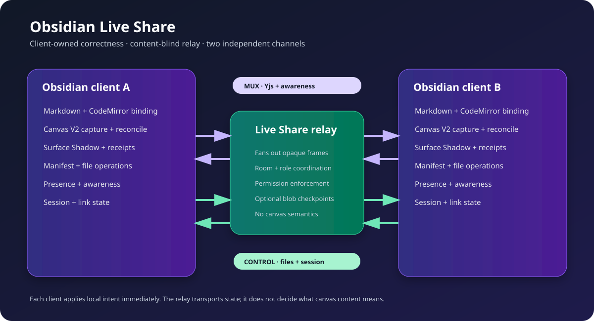
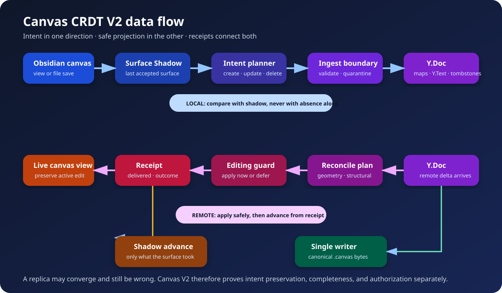

# Obsidian Live Share — Architecture

> **Current architecture reference.** Rewritten on 2026-08-07 against the committed Canvas CRDT V2 implementation and the settled WP1–WP95 feature baseline. Active S104–S113 investigations remain working-state notes in the build specification and are not used to redefine the architecture here.
>
> For exact product verdicts, incomplete work, and release blockers, see [BUILD_SPEC_ObsidianLiveShare.md](workflowArtifacts/BUILD_SPEC_ObsidianLiveShare.md). Historical design papers remain under `workflowArtifacts/` and do not override this document.



## The short version

Obsidian Live Share lets multiple desktop Obsidian clients collaborate through a self-hosted relay. Each client applies local work immediately and exchanges Yjs updates, awareness, file operations, and session events. The relay coordinates rooms and forwards data, but it does not decide what a canvas edit means. Semantic correctness lives in the clients.

Markdown and Canvas use different collaboration paths:

- Markdown binds a Yjs `Y.Text` directly to CodeMirror while the note is open.
- Canvas uses structured CRDT records, a Surface Shadow, explicit apply receipts, and one disk writer.
- Presence and cursors are ephemeral awareness state.
- File creation, deletion, rename, binaries, permissions, and session lifecycle travel over a separate control channel.

The core design lesson is simple: **convergence is not correctness**. Two replicas can converge after both have lost the same user edit. This project therefore treats intent, completeness, authorization, delivery, and convergence as separate facts.

## Runtime topology

```text
Obsidian client A                         Obsidian client B
├── Markdown/editor binding              ├── Markdown/editor binding
├── Canvas V2 capture + reconcile        ├── Canvas V2 capture + reconcile
├── Manifest + file operations           ├── Manifest + file operations
├── Presence + awareness                 ├── Presence + awareness
└── Session + link state                 └── Session + link state
             │                                        │
             ├── MUX WebSocket: Yjs + awareness ──────┤
             └── CONTROL WebSocket: files/session ────┘
                               │
                         Live Share relay
```

### MUX channel

The multiplexed WebSocket carries Yjs synchronization and awareness for many documents over one connection. It transports document deltas, text selections, canvas presence, and peer liveness.

Main modules:

- `plugin/src/sync/sync.ts`
- `plugin/src/sync/mux-protocol.ts`
- `server/src/ws-handler.ts`
- `server/src/mux-protocol.ts`

### CONTROL channel

The control WebSocket carries operations that are not CRDT document updates:

- File create, delete, rename, folder, and binary operations.
- Session and role events.
- Presence metadata and navigation commands.
- Permissions, approvals, host transfer, and audit events.
- Offline queue replay.

Main modules:

- `plugin/src/sync/control-ws.ts`
- `plugin/src/sync/control-handlers.ts`
- `plugin/src/files/file-ops.ts`
- `plugin/src/files/manifest.ts`
- `server/src/control-handler.ts`

The two links are independent. User-facing connection state is derived from measured link state rather than from a single historical “connected once” latch.

## Authority model

The relay is intentionally not a content arbiter. It cannot resolve a semantic canvas conflict because it does not own an Obsidian surface and does not interpret canvas records.

Authority is split by surface:

- The active CodeMirror editor owns an open Markdown note.
- Background text sync owns eligible unopened Markdown files.
- Canvas capture owns local user intent entering the Canvas V2 document.
- Canvas reconcile owns remote document state entering the live Obsidian view.
- `CanvasPersistence` is the plugin's single `.canvas` disk writer.
- The manifest describes shared membership; it does not license destructive cleanup without completeness evidence.

## Markdown data path

### Open note

```text
keystroke → CodeMirror → yCollab → Y.Text → MUX → remote Y.Text → remote CodeMirror
```

The editor and CRDT are directly bound. The local edit is visible without a relay round trip, and concurrent character edits merge through Yjs.

### Unopened note

```text
vault change → BackgroundSync → Y.Text → MUX → remote BackgroundSync → vault file
```

The background path must yield whenever an active editor owns the same note. This single-writer boundary prevents the editor and a file watcher from becoming two independent authorities over one file.

Main modules:

- `plugin/src/editor/collab.ts`
- `plugin/src/files/background-sync.ts`
- `plugin/src/files/vault-events.ts`

## Canvas CRDT V2



Canvas V2 replaced the old “synchronize the whole JSON file” semantic model with record-level state and explicit evidence boundaries.

### Document shape

A canvas document contains structured node and edge records:

- Each record has stable identity.
- Geometry and endpoint fields are atomic registers.
- Ordering uses fractional `ord` values.
- Node text and edge labels use `Y.Text` internally.
- Deletions use tombstones rather than omission alone.
- Internal schema metadata stays out of the user's `.canvas` file.
- Serialization converts internal types explicitly and deterministically.

Important modules:

- `plugin/src/files/canvas-sync.ts`
- `plugin/src/canvas/canvas-registers.ts`
- `plugin/src/canvas/canvas-tombstone.ts`
- `plugin/src/canvas/canvas-ord.ts`
- `plugin/src/canvas/canvas-canonical.ts`
- `plugin/src/canvas/canvas-schema.ts`
- `plugin/src/canvas/canvas-ingest-schema.ts`

### The Surface Shadow

The Surface Shadow is the last state known to have been accepted by the local Obsidian surface. It is deliberately different from:

- The latest Yjs document state.
- The latest bytes written to disk.
- The latest file observed by a watcher.

Local intent is computed by comparing a new surface/file observation with the Surface Shadow. A remote apply advances the shadow only for records the surface demonstrably accepted.

This prevents two dangerous substitutions:

- Treating a stale local save as fresh user intent.
- Treating a remote state that never reached the view as if the user had seen it.

Main module: `plugin/src/canvas/canvas-shadow.ts`.

### Local capture

The production default is `useCanvasBinding = false`. Under that setting, a real Obsidian save reaches:

```text
vault modify
  → CanvasSync.handleLocalModify
  → completeness-aware parse
  → compare with Surface Shadow
  → plan creates, updates, and authorized deletes
  → validate at the ingest boundary
  → apply one Yjs transaction
  → update receipts/shadow
```

The optional binding engine captures from canvas interaction/model signals instead of rereading the file. It remains behind the `useCanvasBinding` feature flag.

### Remote reconcile

```text
remote Yjs delta
  → build canonical canvas state
  → plan field-level reconcile
  → classify geometry versus structural work
  → protect the actively edited record
  → apply now or queue until blur
  → issue per-record receipt
  → advance Surface Shadow from delivery evidence
  → write canonical bytes through CanvasPersistence
```

Geometry for unrelated records can continue while structural work for an actively edited record is deferred. Deferred work drains on blur, view close, and teardown.

Main modules:

- `plugin/src/canvas/reconcile-plan.ts`
- `plugin/src/canvas/canvas-editing-deferral.ts`
- `plugin/src/canvas/canvas-adapter.ts`
- `plugin/src/files/canvas-persistence.ts`
- `plugin/src/main.ts`

### Delete authorization

Absence is not permission to delete. A record may be deleted only when the observation is complete and the applicable surface previously issued a matching receipt:

```text
Delete(X) ⇔ Receipt(X, surface)
          ∧ Complete(save)
          ∧ Present(X)
          ∧ ¬Seen(X, save)
```

This distinction protects against truncated reads, stale files, partial manifests, failed view applies, rejected records, and projection-only omissions.

### Ingest refusal and durability

Invalid records are refused or quarantined before they enter the document. A refusal must never become a delayed deletion after restart.

The seed-refusal store is therefore:

- Local-only.
- Durable.
- Keyed by document identity rather than a host-specific path.
- Migrated or re-derived on rename.
- Consulted before a projection can overwrite the user's file.

Main module: `plugin/src/files/seed-refusal-store.ts`.

## Canvas identity and sidecar history

Paths are mutable, so a path alone is not a durable document identity. Canvas V2 uses:

- A GUID for document identity.
- An epoch for conflict and replacement rules.
- Sidecar history/checkpoints for local durable CRDT state.
- Explicit import when a user intentionally replaces shared truth from a file.

The sidecar is excluded from synchronization and cannot be written by peers.

Main modules:

- `plugin/src/files/canvas-sidecar.ts`
- `plugin/src/files/canvas-sidecar-lifecycle.ts`
- `plugin/src/canvas/canvas-epoch.ts`
- `plugin/src/canvas/canvas-import-command.ts`
- `plugin/src/files/canvas-import.ts`

## Presence and canvas interaction

Presence is awareness state, not document state. It includes peer identity, cursor position, selected/edited card, and canvas membership.

```text
local canvas adapter → CanvasPresence → awareness → MUX → remote CanvasOverlay
```

The overlay is independent from the optional binding engine. A peer can see another collaborator's canvas cursor and card interaction while `useCanvasBinding` remains off.

Private Obsidian Canvas APIs are isolated behind `CanvasAdapter`. The adapter checks capabilities defensively and degrades rather than letting private API drift break the synchronization path.

Main modules:

- `plugin/src/canvas/canvas-presence.ts`
- `plugin/src/canvas/canvas-overlay.ts`
- `plugin/src/canvas/canvas-adapter.ts`

## File operations and manifests

File operations use discriminated operation shapes. A rename is `{type, oldPath, newPath}`; it does not have a generic destination `path` field.

Before an inbound operation reaches the vault, the client applies:

- Path normalization and containment.
- Shared-folder membership.
- `.obsidian/**` protected-path rejection.
- Sidecar/local-state exclusion.
- Permission and role checks.
- Operation-specific source/destination validation.

The manifest is not a delete list. Cleanup requires a complete, authoritative publication path. Missing or partial information fails closed.

Main modules:

- `plugin/src/files/file-ops.ts`
- `plugin/src/files/manifest.ts`
- `plugin/src/files/manifest-purge-decision.ts`
- `plugin/src/files/manifest-removal-decision.ts`
- `plugin/src/files/protected-paths.ts`

## Session, reconnect, and offline behavior

CONTROL and MUX health feed an explicit sharing state. Network failure and session identity are different facts:

- A retry chain may stop transmission and announce that it gave up.
- It must not automatically destroy a valid room identity or clear valid credentials.
- A user can retry the connection without ending the session.
- New offline operations are sealed/refused when the connection state can no longer deliver them safely.
- Host/guest role is applied from the authoritative join response.

Main modules:

- `plugin/src/sync/link-state.ts`
- `plugin/src/sync/control-ws.ts`
- `plugin/src/sync/offline-queue.ts`
- `plugin/src/session/session.ts`
- `plugin/src/main.ts`

## Relay storage

The relay forwards opaque Yjs and awareness frames. Its optional blob/checkpoint store preserves encrypted or otherwise opaque room frames for empty-room recovery without interpreting canvas semantics.

The relay also owns:

- Room lifecycle.
- Host election and transfer.
- Authentication and optional GitHub OAuth.
- Permission enforcement.
- Rate and payload limits.
- WebSocket fan-out.

The relay does not replace client-side CRDT correctness.

## Security boundaries

### Authentication layers

The deployment can combine independent controls:

- TLS for transport security.
- `SERVER_PASSWORD` for relay access.
- Optional GitHub OAuth/JWT identity.
- Per-room invite token.
- Session encryption passphrase.

### Encryption

Session encryption uses AES-GCM-256 with a PBKDF2-derived key. Encrypted room payloads are opaque to the relay. Presence and protocol metadata may still expose operational information, and a deployment without TLS exposes WebSocket traffic in transit.

### Local secrets

Plugin configuration can contain live server and session credentials. Logs, diagnostics, tests, and bug reports must never render those values. See [docs/security.md](docs/security.md) for the threat model and disclosure guidance.

## Concurrency model

JavaScript is single-threaded, but every `await`, timer, file watcher, WebSocket callback, Obsidian save, and reconnect introduces interleaving.

The code uses several serialization devices:

- Per-path ownership decisions.
- Yjs transactions.
- Surface Shadow receipts.
- Canvas apply queues.
- Mute/echo boundaries around plugin disk writes.
- Lifecycle tokens and teardown drains.
- Offline queues and explicit link state.

Timers are safety nets, not trustworthy clocks. Renderer throttling can stretch short nominal delays dramatically, so correctness must also have an event-driven opportunity or an explicit recovery path.

## Observability

Runtime diagnostics use structured signatures and counters for decisions that would otherwise be silent:

- Capture declined and why.
- Shadow stale observations.
- Ingest refusal and restoration.
- Delete withheld and why.
- Mute overruns.
- Link-state changes and retry exhaustion.
- Protected-path refusals.
- Sidecar lifecycle and degradation.

Absence from a debug log is evidence only after the sink, setting, flush watermark, and a positive control have been established.

## Testing architecture

The project uses four complementary layers:

1. Pure decision tests for parsing, planning, receipts, path gates, and state machines.
2. Component tests with in-memory vault and Yjs replicas.
3. Deterministic fuzz/chaos tests for convergence and preservation invariants.
4. Two-instance live Obsidian validation through the E2E control surface.

The E2E build is produced with `npm run build:e2e`. The real default Canvas capture path is a `.canvas` file save routed through `handleLocalModify`; direct `Y.Doc` mutation is useful for narrow protocol tests but is not evidence that capture works.

Every correctness assertion should be falsifiable: plant the regression it protects, show the relevant check red, restore byte-identically, and show it green.

## Repository map

```text
obsidian-live-share/
├── plugin/                         ← Obsidian desktop plugin
│   └── src/
│       ├── canvas/                 ← Canvas V2 model, adapter, presence, planning
│       ├── editor/                 ← CodeMirror/Yjs Markdown binding
│       ├── files/                  ← manifests, file ops, persistence, sidecar
│       ├── session/                ← auth, commands, presence UI, session state
│       ├── sync/                   ← MUX/CONTROL links, crypto, offline queue
│       ├── testing/                ← E2E control surface
│       └── __tests__/              ← unit, integration, fuzz, WP regressions
├── server/                         ← self-hosted relay
│   └── src/
├── tools/obsidian_e2e/             ← real two-vault orchestration utilities
├── docs/                           ← user/developer documentation and diagrams
├── workflowArtifacts/              ← specification and historical engineering record
├── ARCHITECTURE.md                 ← this document
├── README.md                       ← public project entry point
└── LICENSE                         ← MIT license and upstream notice
```

## Stable invariants

- One semantic owner and one plugin disk writer per shared surface.
- The file is not silently promoted to current intent while another surface owns it.
- Convergence never substitutes for intent preservation.
- Absence never creates destructive authorization.
- Invalid input degrades or withholds; it does not fabricate valid state.
- The relay stays content-blind.
- Presence stays ephemeral.
- Sidecar and local safety state stay peer-unreachable.
- A failed apply does not advance the Surface Shadow.
- Tests used as release evidence must be shown capable of failing.

## Known incomplete areas

The architecture is implemented far beyond the original upstream design, but the project is still under active stabilization. The authoritative list is maintained in the [build specification](workflowArtifacts/BUILD_SPEC_ObsidianLiveShare.md). At the current settled baseline:

- Room-mode consensus and Receive-and-Persist are incomplete as a full phase.
- Operation capture is not yet promoted as the universal primary Canvas source.
- The final real-host release matrix is not complete.
- Cross-platform canonical path identity needs a future wire-format decision.
- Some durable-refusal and UI-lifecycle edge cases remain under investigation.

These are stated boundaries, not hidden “probably fine” assumptions.
